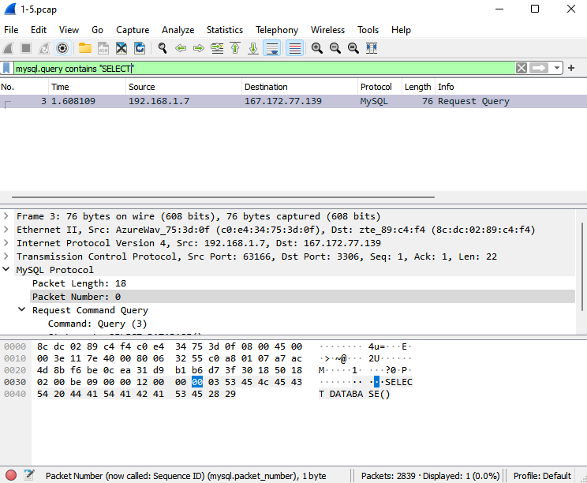

# Jarkom-Modul-1-A12-2021
Jarkom_Modul1_Lapres_A12

**Praktikum Modul 1 - Jaringan Komputer 2021**
**A12**
-   Fiqey Indriati Eka Sari (05111940000015)
-   Dyah Putri Nariswari (05111940000047)
-   Muhammad Farrel Abhinaya (05111940000173)

### Soal 1
Sebutkan web server yang digunakan pada \"[[ichimarumaru.tech]{.ul}](http://ichimarumaru.tech/)\"!

**wireshark filter expression:** http.host contains "ichimarumaru.tech"

> Untuk mengetahui web server yang digunakan dapat menuliskan expression
> http.host contains "ichimarumaru.tech"


**wireshark filter expression:** tcp.stream eq 43

Lalu, lakukan Follow -\> TCP stream dan ditemukan hasil seperti berikut.
Web server yang digunakan ialah ECS (frv/669E)


### Soal 2
Temukan paket dari **web-web** yang menggunakan **basic authentication** method!

> **wireshark filter expression:** http.authbasic
>
> 

### Soal 3

Ikuti perintah di [[basic.ichimarumaru.tech]{.ul}](http://basic.ichimarumaru.tech/)! Username dan password bisa didapatkan dari file .*pcapng*!

**wireshark filter expression:** http.host contains "basic.ichimarumaru.tech"

> Pertama kita mengisi filter dengan expression http.host contains
> "basic.ichimarumaru.tech"
>
> 
>
> Setelah itu, kita temukan credentials yang berisi username dan
> password untuk menuju ke web basic.ichimarumaru.tech

**wireshark filter expression:** http.host contains
basic.ichimarumaru.tech

> 
>
> 
>
> Web berhasil terbuka, dan diminta untuk mengisi jawaban dari soal yang
> tertera
>
> 

### Soal 4
Temukan paket **mysql** yang mengandung **perintah** **query select**!

> **wireshark filter expression:** mysql.query contains "select" \|\|
> mysql.query contains "SELECT"
>
> 
>
> 

### Soal 5
Login ke [[portal.ichimarumaru.tech]{.ul}](http://portal.ichimarumaru.tech/) kemudian ikuti perintahnya! Username dan password bisa didapat dari **query insert** pada table **users** dari file .pcap!

> **wireshark filter expression:** mysql.query contains "INSERT"
>
> 
>
> INSERT INTO users (username,password) VALUES
> (\"akakanomi\",md5(\"pemisah4lautan\"))
>
> 

### Soal 6
Cari username dan password ketika melakukan login ke FTP Server!

Untuk mencari username dan password dapat menggunakan wireshark filter expression yaitu, ```ftp.request.command contains USER || ftp.request.command contains PASS```. Didaptkan username: secretuser dan pass: aku.pengen.pw.aja


### Soal 7
Ada 500 file zip yang disimpan ke FTP Server dengan nama 0.zip, 1.zip, 2.zip, ..., 499.zip. Simpan dan Buka file pdf tersebut. (Hint = nama pdf-nya "Real.pdf")

Mengisi display filter dengan wiresshark filter expression yaitu, ```frame contains “Real.pdf”```. 


Lalu, Follow --> TCP Stream dan mengubah data menjadi Raw. Setelah itu simpan file dengan nama Real.pdf. Wireshark filter expression nya yaitu, ```tcp.stream eq 128```


File, Real.pdf berhasil dibuka


### Soal 8
Cari paket yang menunjukan pengambilan file dari FTP tersebut!

Gunakan wireshark filter expression ```ftp.request.command == RETR```


Karena kosong, maka dilakukan percobaan filter lainnnya menggunakan wireshark filter expression yaitu, ```ftp.response.code==150 || ftp.response.code==226```


### Soal 9
Dari paket-paket yang menuju FTP terdapat indikasi penyimpanan beberapa file. Salah satunya adalah sebuah file berisi data rahasia dengan nama "secret.zip". Simpan dan buka file tersebut!

Mengisikan display filter dengan wireshark filter expression yaitu, ```ftp-data```


Lalu, Follow --> TCP Stream dan mengubah data menjadi Raw. Setelah itu simpan file dengan nama secret.zip. Wireshark filter expression nya yaitu, ```tcp.stream eq 10```.


### Soal 10
Selain itu terdapat "history.txt" yang kemungkinan berisi history bash server tersebut! Gunakan isi dari "history.txt" untuk menemukan password untuk membuka file rahasia yang ada di "secret.zip"!

Mengisikan display filter dengan wireshark filter expression yaitu, ```ftp-data```


Lalu, Follow --> TCP stream dan ditemukan hasil seperti berikut. Wireshark filter expression nya yaitu, ```tcp.stream eq 9```


Selanjutnya, masukan lagi wireshark filter expression, ``ftp-data``. Lalu, kita mencari paket yang mengandung file bukanapaapa.txt


Lalu, lakukan Follow --> TCP stream dan didapat password untuk membuka file secret.zip. Wireshark filter expression nya yaitu, ```tcp.stream eq 11```


Masukan password untuk membuka file secret.zip. File berhasil dibuka


### soal 11
Filter sehingga wireshark hanya mengambil paket yang berasal dari port 80

__Wireshark filter expression__ : ```udp.srcport == 80 || tcp.srcport == 80```


### soal 12
Filter sehingga wireshark hanya mengambil paket yang mengandung port 21!

__Wireshark filter expression__ : ```port 21```


### soal 13
Filter sehingga wireshark hanya menampilkan paket yang menuju port 443!

__Wireshark filter expression :__ ```dst port 443```


### soal 14
Filter sehingga wireshark hanya mengambil paket yang tujuannya ke kemenag.go.id!

pertama, buka kemenag.go.id


kemudian isi __Wireshark filter expression__ dengan ```dst host kemenag.go.id``` lalu lakukan refresh pada page kemenag.go.id


### soal 15
Filter sehingga wireshark hanya mengambil paket yang berasal dari ip kalian!
Ip yang digunakan :

Untuk mengetahui ip, dapat menggunakan perintah ```ipconfig``` pada terminal


__Wireshark filter expression :__ ```src host 192.168.1.6```


## Kendala
- Pada soal nomor 1, sempat terjadi kesalahan karena host yang dipilih ternyata bukan ichimarumaru.tech
